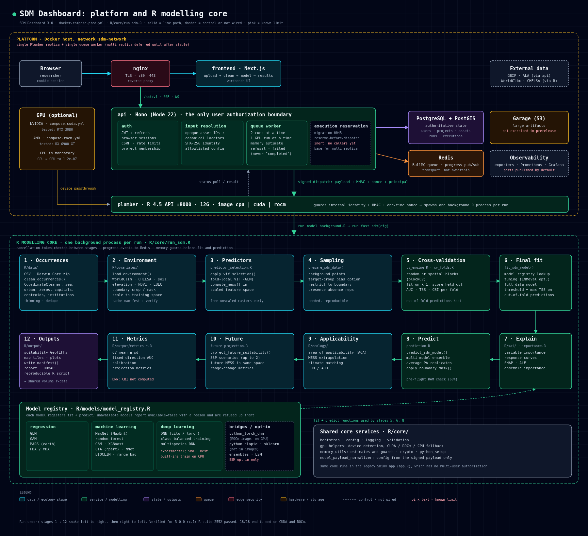

# SDM Dashboard

[](https://github.com/unstable-branch/sdm-dashboard/releases)
[](https://github.com/unstable-branch/sdm-dashboard/actions/workflows/platform-ci.yml?query=branch%3Amain)
[](https://github.com/unstable-branch/sdm-dashboard/actions/workflows/r-quality.yml?query=branch%3Amain)
[](LICENSE)


Open-source species distribution modelling (SDM) platform: upload occurrence records, clean them, fit and cross-validate models against climate and environmental layers, and review suitability maps, diagnostics and reproducible outputs from a browser.

**Status: 3.0.0 release candidate.** 3.0 is the first stable line of the modern platform. Validate ecological outputs carefully before operational use; see [Known limitations](#known-limitations).



## What's in the box

- **Web app:** Next.js dashboard for the upload → clean → model → results workflow.
- **API:** Hono (Node 22). Authentication, projects and membership, input resolution, queueing and authorization. It is the only user-facing authorization boundary.
- **Modelling engine:** R 4.5 behind Plumber. Occurrence cleaning (CoordinateCleaner), WorldClim/CHELSA covariates, VIF selection, random or spatial-block cross-validation, GLM, GAM, MaxNet, MARS, FDA, CTA, random forest, GBM/XGBoost, DNN and ensembles, plus importance, response curves, area of applicability, MESS, future SSP projections and a reproducible R script for each run.
- **State:** PostgreSQL/PostGIS, Redis/BullMQ, Garage (S3-compatible) object storage.
- **Compute:** CPU by default. Optional NVIDIA (CUDA) and AMD (ROCm) Plumber images.

## Install (self-hosted)

You need Docker with Compose v2. R is not needed on the host.

1. Download `release-images.env` from the [release](https://github.com/unstable-branch/sdm-dashboard/releases) you want. It pins the exact image digests.
2. Clone the repository at that release tag, and create `.env` from `.env.example` with real secrets.
3. Start it:

```bash
# CPU
docker compose --env-file release-images.env --env-file .env \
  -f docker-compose.prod.yml up -d --no-build

# NVIDIA: set SDM_PLUMBER_VARIANT=cuda and the cuda digest in release-images.env
docker compose --env-file release-images.env --env-file .env \
  -f docker-compose.prod.yml -f deploy/compose.cuda.yml up -d --no-build

# AMD: set SDM_PLUMBER_VARIANT=rocm, the rocm digest, AMD_VIDEO_GID and AMD_RENDER_GID
docker compose --env-file release-images.env --env-file .env \
  -f docker-compose.prod.yml -f deploy/compose.rocm.yml up -d --no-build
```

Only nginx (ports 80/443) is published. Monitoring (Prometheus, Grafana) is opt-in with `--profile monitoring` and binds to localhost. See [PRODUCTION.md](PRODUCTION.md) for TLS, secrets, backups and sizing. Plumber needs about 12 GB of RAM for two concurrent runs.

## First workflow

1. Register, then create a project.
2. Upload a CSV or a Darwin Core Archive (`.zip`). `data/examples/synthetic_presence_data.csv` works for a smoke test.
3. Review the detected columns and the cleaning report.
4. Configure a run: model, climate layers, cross-validation.
5. Watch progress, then review metrics, maps, diagnostics and downloads.

Synthetic examples are for smoke testing only, not ecological evidence.

## Known limitations

- **One Plumber replica and one queue worker.** Each Plumber runs two models at a time (one on the GPU). Extra runs queue, and runs that would exceed memory are refused with a reason. Multi-replica execution is planned after 3.0.
- **DNN is experimental.** DNN_Small is the recommended size. On AMD, use `python_torch_dnn`, which runs on the GPU. The built-in R DNNs are small enough that they train on CPU.
- **Optional models:** ESM is opt-in (`SDM_ENABLE_ESM=true`). Python elapid and scikit-learn bridges are not in the published images. ENMeval, biomod2, BART, INLA and unmarked need packages the images don't include.
- **Targets/batch execution** is unavailable until durable execution ownership lands.

Full details are in [CHANGELOG.md](CHANGELOG.md) and [docs/STATUS.md](docs/STATUS.md).

## Development

```bash
pnpm install --frozen-lockfile
./scripts/dev-start.sh            # backing services in Docker
(cd api && pnpm dev)              # API on :4000
(cd frontend && pnpm dev)         # UI on :3000
```

Or run the whole stack locally with `docker compose -f docker-compose.yml --profile full up` (first start builds the Plumber image and takes several minutes).

Checks to run before opening a PR:

```bash
pnpm run check:node
pnpm run check:compose
pnpm run check:release
Rscript scripts/smoke_test.R --tags=fast
Rscript tests/testthat.R
git diff --check
```

CI runs the same gates, plus the locked R suite, Docker integration, a PostgreSQL migration contract and GPU unit tests. See [CONTRIBUTING.md](CONTRIBUTING.md) for the branch and release flow and [docs/DEVELOPMENT.md](docs/DEVELOPMENT.md) for setup detail.

## Repository layout

| Path | Purpose |
| --- | --- |
| `frontend/` | Next.js dashboard |
| `api/` | Hono API, auth, Drizzle schema and migrations, queue worker |
| `packages/shared/` | Shared TypeScript schemas |
| `plumber/` | Plumber service and its CPU/CUDA/ROCm Dockerfiles |
| `R/` | Modelling core: data, covariates, models, ecology, outputs, XAI |
| `python_models/`, `sdmtorch/` | Python model bridges and Torch extensions |
| `deploy/` | Production GPU overlays and the image digest template |
| `docs/` | Architecture, methods, interpretation, status, roadmap |
| `tests/` | R test suite |

## Documentation

- [docs/ARCHITECTURE.md](docs/ARCHITECTURE.md): system contracts and trust boundaries
- [docs/METHODS.md](docs/METHODS.md) and [docs/INTERPRETATION.md](docs/INTERPRETATION.md): modelling methods and reading outputs
- [PRODUCTION.md](PRODUCTION.md) and [docs/DEPLOY.md](docs/DEPLOY.md): deployment
- [docs/STATUS.md](docs/STATUS.md) and [docs/ROADMAP.md](docs/ROADMAP.md): current evidence and what's next
- [inst/TROUBLESHOOTING.md](inst/TROUBLESHOOTING.md): GPU and Torch troubleshooting

## Legacy R/Shiny desktop app

The original single-user Shiny app is still included for local desktop use (`Rscript launch_app.R`, or `run_app_windows.bat` on Windows; see [README_WINDOWS.md](README_WINDOWS.md)). It has no multi-user authentication, so keep it private. New work targets the platform above. See [docs/LEGACY_AND_CRAN.md](docs/LEGACY_AND_CRAN.md).

## Data and privacy

Don't commit real occurrence data (unless it's public and redistributable), downloaded rasters, generated outputs, logs, `.env`/`.Renviron` files, keys or tokens.

## Contributing, citation and license

See [CONTRIBUTING.md](CONTRIBUTING.md), [CODE_OF_CONDUCT.md](CODE_OF_CONDUCT.md), [SECURITY.md](SECURITY.md) and [CITATION.cff](CITATION.cff). MIT licensed.
