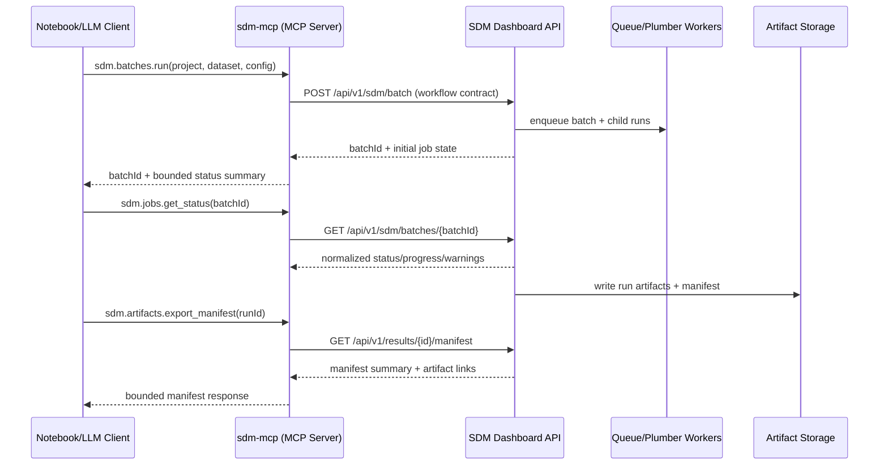

# SDM Dashboard <-> sdm-mcp Alignment

This note defines the ownership boundary between `sdm-dashboard` and
`sdm-mcp`, and the migration path from local-first MCP prototyping to a
dashboard-backed MCP adapter.

## Ownership Boundary

`sdm-dashboard` owns the product and machine API contract:

- auth and API keys
- projects
- datasets
- batches
- jobs and async lifecycle
- artifacts and manifests
- quotas, scopes, audit policy

`sdm-mcp` owns MCP interface concerns:

- MCP transport (`stdio` now; other transports later)
- tool/resource presentation and response shaping
- local-first prototype workflows under workspace safety rules
- host-client ergonomics for notebook/CLI/LLM usage

Rule: MCP is an adapter over product workflow contracts, not a second product
backend.

## Relationship By Horizon

### Short-term (now)

- `sdm-mcp` remains a local `stdio` + workspace prototype lane.
- Dashboard API contract hardening proceeds first (agentic Phase 1+).
- MCP prototyping can continue locally, but should not force dashboard schema
  churn before contracts stabilize.

### Medium-term (after stable dashboard workflow contracts)

- `sdm-mcp` adds a `dashboard-api` backend/provider that calls the dashboard
  workflow endpoints.
- Existing local-first backend can remain for offline/prototype workflows.
- Tool and resource schemas should remain stable while backend selection
  (`local` vs `dashboard-api`) changes behind the interface.

## What Must Not Happen

- Do not create a duplicate modelling engine in `sdm-mcp`.
- Do not let remote clients bypass dashboard API controls by talking directly
  to Plumber or filesystem paths.
- Do not ship a giant endpoint-to-tool wrapper that mirrors every REST route.
  Keep MCP workflow-level and curated.

## Phase Mapping: Dashboard API -> sdm-mcp Roadmap (v0.2-v0.5)

| Dashboard API phase | Contract outcome in dashboard | sdm-mcp roadmap linkage |
| --- | --- | --- |
| Phase 1 (contract baseline) | Stable route docs, auth model, key workflow examples | v0.2 tools stay local-first while adopting shared naming and bounded-output conventions that will map cleanly to dashboard endpoints later |
| Phase 2 (workflow objects) | Stable objects for datasets, study areas, environment sets, runs, batches | v0.2-v0.3 can mirror these object concepts in local state; this is the minimum prerequisite for a future `dashboard-api` provider |
| Phase 3 (agent-grade async jobs) | Normalized status/error shape, polling and cancellation semantics | v0.4 modelling tools should align status vocabulary so swapping local execution for dashboard jobs is mechanical |
| Phase 4 (provenance/artifact manifests) | Run/batch manifests and report-safe summaries | v0.5 reporting/export tools should emit equivalent summary structure and artifact references |
| Phase 5 (notebook/CLI surface) | API-only workflows proven without browser | v0.5+ can add dashboard-backed MCP tools with confidence because notebook/API behavior is already validated |

## Naming Guidance For Future MCP Adapter

Use workflow nouns and explicit verbs. Prefer stable, transport-agnostic names.

Tool naming guidance:

- Prefix with `sdm.` and group by workflow domain.
- Use action verbs on concrete workflow entities.
- Keep names short and API-independent.

Suggested tool set:

- `sdm.projects.create`
- `sdm.occurrences.register_dataset`
- `sdm.occurrences.summarize_dataset`
- `sdm.batches.prepare`
- `sdm.batches.run`
- `sdm.jobs.get_status`
- `sdm.runs.compare`
- `sdm.artifacts.export_manifest`
- `sdm.reports.generate_methods`

Resource naming guidance:

- Use canonical URI-like identifiers.
- Return summaries by default; include artifact IDs/links rather than large
  payloads.

Suggested resource ids:

- `sdm://projects/{projectId}/summary`
- `sdm://projects/{projectId}/datasets/{datasetId}/summary`
- `sdm://projects/{projectId}/batches/{batchId}/summary`
- `sdm://runs/{runId}/summary`
- `sdm://runs/{runId}/manifest`
- `sdm://runs/{runId}/methods-report`

## Example Flow (Dashboard-backed MCP)

## Next Actions

For `sdm-dashboard`:

1. Finish Phase 1 contract artifacts (OpenAPI baseline, route auth labeling,
   workflow happy-path examples).
2. Define normalized job status/error vocabulary in Phase 3 docs before MCP
   backend work starts.
3. Lock first manifest schema fields in Phase 4 for run/batch outputs.

For `sdm-mcp`:

1. Keep v0.2-v0.5 local-first delivery moving, but align tool semantics with
   dashboard workflow object names.
2. Add an internal backend abstraction seam (`local` and future
   `dashboard-api`) without changing public tool names.
3. Prepare a minimal read-only dashboard-backed slice first (project/run/batch
   summaries) before write/run operations.
